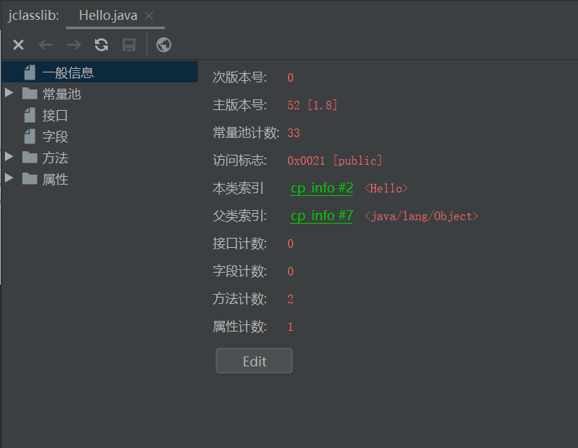
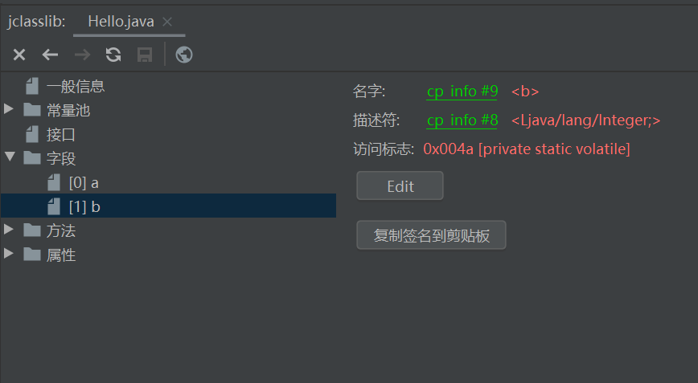
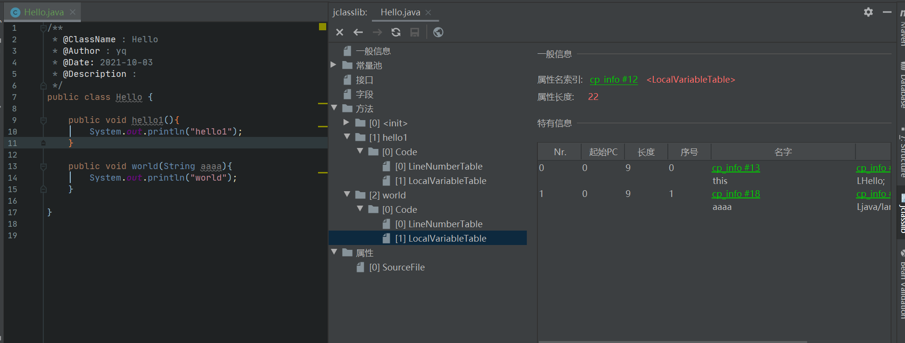

> .java文件经过编译之后会生成.class文件，再通过JVM运行
>
> 在平时工作时经常会使用到Class类，特此通过阅读《深入理解Java虚拟》部分内容研究一下字节码文件
>
> 
>
> 推荐一个工具jclasslib bytecode viewer，在idea插件中安装即可

下面简单记录字节码文件中所包含的内容，详细部分针对具体问题再研究

* 魔数

  > 前四个字节为魔数

* 次版本号

* 主版本号

  > 跟jdk版本相关，1.8为53

* 常量池

  > 包含常量池和符号引用
  >
  > **最复杂的一部分**

* 访问标志

  > 用于标识类、接口、枚举、注解或者public等等

* 本类索引

  > 用于确定类名
  >
  > 类名通过引用符号的形式存储在常量池中

* 父类索引

  > 用于确定这个类的父类的全限定名
  >
  > 如果该类显示继承了父类，则显示父类全限定名
  >
  > 如果没有继承父类，则显示为Object

* 字段表集合

  > 用于描述接口或者类中声明的变量，不包含方法中的变量
  >
  > 还包含字段的修饰信息
  >
  > 关于字符名称，字段值等信息存储在常量池中

* 方法表集合

  > 记录类中方法相关信息，包括方法名，修饰符，访问标志，属性集合等
  >
  > 注意init方法

* 属性表集合

  > 属性表集合记录属性信息
  >
  > code为属性名称，表示在方法表中使用
  >
  > sourceFile表示属性在类文件中使用
  >
  > 属性类型分为很多种，细节部分再研究