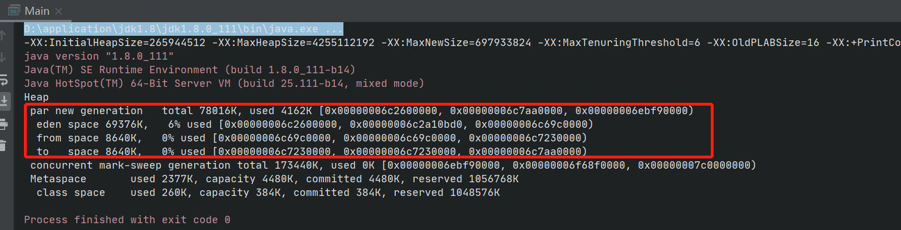
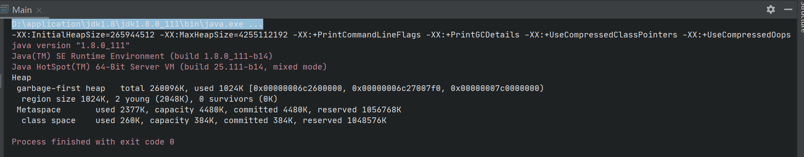
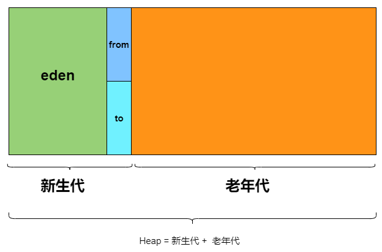

> 最近通过JOL工具研究了Java对象的构造，通过阅读《深入理解Java虚拟机》将堆的一些理解整理如下

创建对象时，需要为对象分配内容，此处的内存就是在堆中进行分配的；当对象死亡时，对象的内存需要被回收

在平时开发过程中，会遇到OOM异常，此异常就是堆内存不足

内存回收需要垃圾收集器，常用的垃圾收集器有**CMS和G1**，还有Serial

此处回顾一下垃圾收集算法：

> 1.引用计数器法
>
> 2.可达性分析法
>
> 3.标记-清除算法
>
> 4.标记-整理算法
>
> 5.分代收集算法
>
> 每种收集算法有各自优缺点，在垃圾收集器中会综合应用

## CMS

> CMS垃圾收集器是服务端的一种垃圾收集器

idea 配置参数：

> -XX:+UseConcMarkSweepGC -XX:+PrintGCDetails -XX:+PrintCommandLineFlags -version
>
> 指定CMS垃圾收集器

从gc日志可以看出，堆分为par new generation 和 concurrent mark-sweep generation，通俗讲，新生代和老年代；而新生代分为eden，from，to三个区

## G1

> G1收集器中的内存区域划分与其他垃圾收集器有非常大的差距

idea配置：

> -XX:+UseG1GC -XX:+PrintGCDetails -XX:+PrintCommandLineFlags -version

从gc日志看出，G1垃圾收集器中以分区-region进行划分的

## 新生代和老年代

在除G1垃圾收集器之外的其他垃圾收集器中，内存**划分为新生代和老年代**，其中新生代分为eden，from，to三个区域

> 老年代2/3  
>
> 新生代1/3   (eden 8/10，from 1/10，to 1/10)

* 垃圾回收过程

> 1.创建对象时，在eden区分配分配内存，
>
> 2.垃圾回收时，讲新生代中存活的对象和from中存活的对象复制到to区域中 （**新生代使用复制算法**），个人理解from和to两个区域在每次gc时是互换的
>
> 3.每次gc时，如果对象没有被回收掉则age+1，此age在对象头中；当一个对象的age增大到一定值后被复制到老年代，age默认是15 （-XX:MaxTenuringThreshold）

# 分区

> 分区是存在G1垃圾收集器中的

在G1收集器中将堆内存划分为多个分区，每次gc只针对具体分区进行垃圾回收

* 优化点：

  > 1.gc时针对具体的分区进行，不会全量gc
  >
  > 2.维护优先列表，优先对价值最大的分区的进行回收