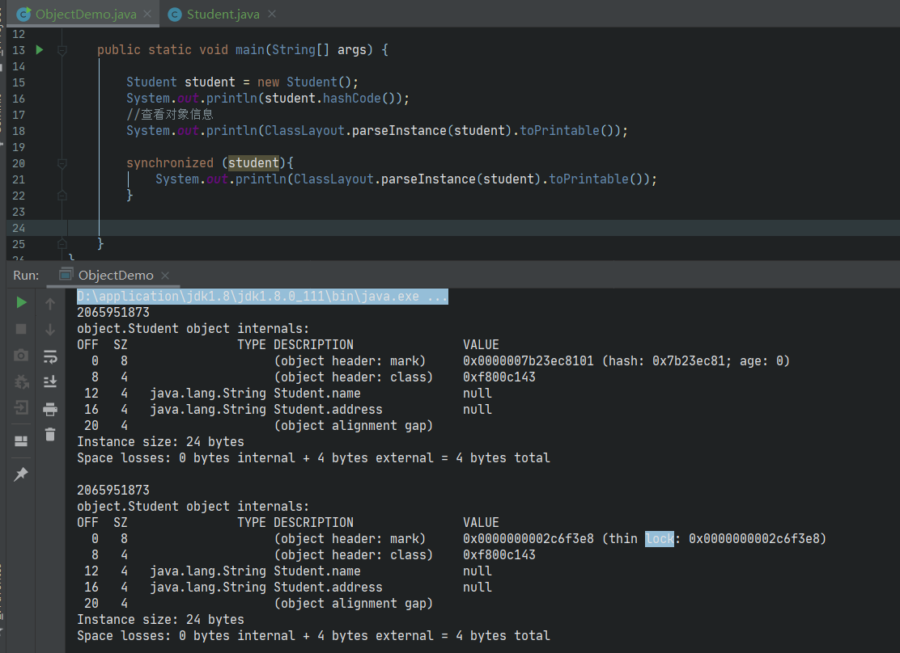

> 在阅读源码的过程中，经常遇到Object object = new Object()；这样的代码，并且此object被用来做同步相关的动作，通过阅读《深入理解Java虚拟机》相关内容，将关于对象的理解进行归纳

借助jol工具来研究对象

```xml
<!-- https://mvnrepository.com/artifact/org.openjdk.jol/jol-core -->
<dependency>
    <groupId>org.openjdk.jol</groupId>
    <artifactId>jol-core</artifactId>
    <version>0.16</version>
</dependency>
```

Java 基础知识点是环环相扣的，从下面一条线理解对象

> 创建对象->分配内存->对象初始化->对象组成部分->对象头->加锁->锁膨胀/锁升级->对象回收

## jvm信息

```java
public static void main(String[] args) {
    //查看虚拟机信息
    System.out.println(VM.current().details());
}
```


## 对象信息



由上图可知：对象的组成部分分为**对象头，实例数据，对齐填充**

### 对齐填充

> JVM在为对象分配内存时，如果对象大小不满8byte的整数倍，则进行对齐填充
>
> 由上图可知对象一共20byte，对齐填充4byte

### 对象头

> **对象头中包含GC年龄，hashCode，指定类的指针，锁记录指针，重量级锁指针，锁标志**
>
> 这部分数据统称为Mark Word


### hashCode

> 在创建对象时，对象的hashCode并不会生成，当在调用hashCode()方法时，会生成对象的hashCode并存储在对象头中


