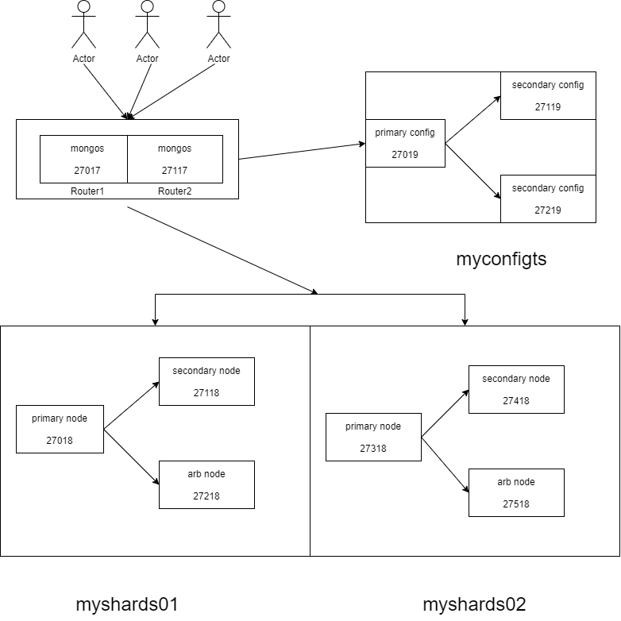

> 结合对项目线上MongoDB集群了解以及MongDB官方文档，通过搭建MongoDB分片集群，将学习及搭建过程记录如下


## 分片集群

### 分片角色

> 分片集群中共有三个角色

* shardsvr 

  > 存储数据

* configsvr

  > 配置信息

* 路由节点，负责转发路由

### 分片规则

> 同一个集合之中只能通过一个字段进行分片，且**根据字段进行分片**

* 哈希规则

  > 通过对集合中的某个进行哈希，然后存储到指定的分片中

* 范围策略

  > 通过数字shard key，将文档划分到不同的**数据块**中

### chunk

MongoDB进行分片之后，数据会以chunk为单位(默认64MB)分配到不同的shard上

当chunk的大小达到指定大小之后，MonoDB会分裂这是chunk

> 个人理解文档存储在数据块中，数据块处于不同的分片中，待详细研究

### 性能对比

范围分片适合范围查询

> 路由根据范围去不同的数据块中查询数据
>
> 如果shard key所在字段成线性增长，则会导致大量文档存储在同一个数据块中，数据分布不均

哈希分片可保证数据的均匀分配

## 搭建步骤




### 搭建数据节点

> 每个分片节点内部都是一个副本集集群

* 分片myshards01

  ```shell
  net:
    port: 27018
    bindIp: 0.0.0.0  #允许连接地址，这里统一设置为允许任何ip连接
  systemLog:
    destination: file
    logAppend: true
    path: D:\application\mongo\shardcluster\shard\shard27018\log\mongod.log
  storage:
    dbPath: D:\application\mongo\shardcluster\shard\shard27018\data\db   #数据存储位置
    journal:
      enabled: true #数据故障恢复和持久化，肯定是开启
  #副本集名称设置
  replication:
    replSetName: myshards01
  sharding:
    clusterRole: shardsvr
  ```

* 分片myshards02

  ```shell
  net:
    port: 27318
    bindIp: 0.0.0.0  #允许连接地址，这里统一设置为允许任何ip连接
  systemLog:
    destination: file
    logAppend: true
    path: D:\application\mongo\shardcluster\shard\shard27318\log\mongod.log
  storage:
    dbPath: D:\application\mongo\shardcluster\shard\shard27318\data\db   #数据存储位置
    journal:
      enabled: true #数据故障恢复和持久化，肯定是开启
  #副本集名称设置
  replication:
    replSetName: myshards02
  sharding:
    clusterRole: shardsvr
  ```

  


### 搭建配置节点

> 三个节点27019，27119，27219 副本方式启动，不设置协调节点

* 27019

  ```shell
  net:
    port: 27019
    bindIp: 0.0.0.0  #允许连接地址，这里统一设置为允许任何ip连接
  systemLog:
    destination: file
    logAppend: true
    path: D:\application\mongo\shardcluster\config\config27019\log\mongod.log
  storage:
    dbPath: D:\application\mongo\shardcluster\config\config27019\data\db   #数据存储位置
    journal:
      enabled: true #数据故障恢复和持久化，肯定是开启
  #副本集名称设置
  replication:
    replSetName: myconfigrs
  sharding:
    clusterRole: configsvr
  ```

* 27119

  ```shell
  net:
    port: 27119
    bindIp: 0.0.0.0  #允许连接地址，这里统一设置为允许任何ip连接
  systemLog:
    destination: file
    logAppend: true
    path: D:\application\mongo\shardcluster\config\config27119\log\mongod.log
  storage:
    dbPath: D:\application\mongo\shardcluster\config\config27119\data\db   #数据存储位置
    journal:
      enabled: true #数据故障恢复和持久化，肯定是开启
  #副本集名称设置
  replication:
    replSetName: myconfigrs
  sharding:
    clusterRole: configsvr
  ```

* 27219

  ```shell
  net:
    port: 27219
    bindIp: 0.0.0.0  #允许连接地址，这里统一设置为允许任何ip连接
  systemLog:
    destination: file
    logAppend: true
    path: D:\application\mongo\shardcluster\config\config27219\log\mongod.log
  storage:
    dbPath: D:\application\mongo\shardcluster\config\config27219\data\db   #数据存储位置
    journal:
      enabled: true #数据故障恢复和持久化，肯定是开启
  #副本集名称设置
  replication:
    replSetName: myconfigrs
  sharding:
    clusterRole: configsvr
  ```

  

### 搭建router

> router服务不需要db，负责路由转发

27017：

```shell
net:
  port: 27017
  bindIp: 0.0.0.0  #允许连接地址，这里统一设置为允许任何ip连接
systemLog:
  destination: file
  logAppend: true
  path: D:\application\mongo\shardcluster\router\router27017\log\mongod.log
sharding:
  configDB: myconfigrs/127.0.0.1:27019,127.0.0.1:27119,127.0.0.1:27219
 
```

27117:

```shell
net:
  port: 27117
  bindIp: 0.0.0.0  #允许连接地址，这里统一设置为允许任何ip连接
systemLog:
  destination: file
  logAppend: true
  path: D:\application\mongo\shardcluster\router\router27117\log\mongod.log
sharding:
  configDB: myconfigrs/127.0.0.1:27019,127.0.0.1:27119,127.0.0.1:27219
```

* 启动router服务：

  > mongos -f ..\mongos.conf

* 添加分片

  > sh.addShard("myshards01/DESKTOP-181ETLN:27018,DESKTOP-181ETLN:27118,DESKTOP-181ETLN:27218")
  >
  > sh.addShard("myshards02/DESKTOP-181ETLN:27318,DESKTOP-181ETLN:27418,DESKTOP-181ETLN:27518")

* 初始化

  * 数据库

    > sh.enableSharding("articledb")

  * 集合

    > sh.shardCollection("namespace,key,unique")
    >
    > sh.shardCollection("articledb.comment",{"nickname":"hashed"})
    >
    > sh.shardCollection("articledb.author",{"age":1})
    >
    > 对comment的nickname进行hash分片
    >
    > 对author的age进行范围分片

* 查看分片状态sh.status()

  ```shell
  --- Sharding Status ---
    sharding version: {
          "_id" : 1,
          "minCompatibleVersion" : 5,
          "currentVersion" : 6,
          "clusterId" : ObjectId("6151d33878373f94e9b01512")
    }
    shards:
          {  "_id" : "myshards01",  "host" : "myshards01/DESKTOP-181ETLN:27018,DESKTOP-181ETLN:27118",  "state" : 1 }
          {  "_id" : "myshards02",  "host" : "myshards02/DESKTOP-181ETLN:27318,DESKTOP-181ETLN:27418",  "state" : 1 }
    active mongoses:
          "4.2.17-rc0-5-g294ba52" : 2
    autosplit:
          Currently enabled: yes
    balancer:
          Currently enabled:  yes
          Currently running:  yes
          Failed balancer rounds in last 5 attempts:  0
          Migration Results for the last 24 hours:
                  415 : Success
                  1 : Failed with error 'aborted', from myshards01 to myshards02
    databases:
          {  "_id" : "articledb",  "primary" : "myshards02",  "partitioned" : true,  "version" : {  "uuid" : UUID("e9307ab7-52ce-4889-ae85-586465c9ba41"),  "lastMod" : 1 } }
                  articledb.comment
                          shard key: { "nickname" : "hashed" }
                          unique: false
                          balancing: true
                          chunks:
                                  myshards01      2
                                  myshards02      2
                          { "nickname" : { "$minKey" : 1 } } -->> { "nickname" : NumberLong("-4611686018427387902") } on : myshards01 Timestamp(1, 0)
                          { "nickname" : NumberLong("-4611686018427387902") } -->> { "nickname" : NumberLong(0) } on : myshards01 Timestamp(1, 1)
                          { "nickname" : NumberLong(0) } -->> { "nickname" : NumberLong("4611686018427387902") } on : myshards02 Timestamp(1, 2)
                          { "nickname" : NumberLong("4611686018427387902") } -->> { "nickname" : { "$maxKey" : 1 } } on : myshards02 Timestamp(1, 3)
          {  "_id" : "config",  "primary" : "config",  "partitioned" : true }
                  config.system.sessions
                          shard key: { "_id" : 1 }
                          unique: false
                          balancing: true
                          chunks:
                                  myshards01      609
                                  myshards02      415
                          too many chunks to print, use verbose if you want to force print
  ```
  
  * 循环插入数据
  
    ```javascript
    for(var i = 1;i<=1000;i++){db.comment.insertOne({_id:i+"",nickname:"BoBo"+i})}
    
    for(var i = 1;i<=20000;i++){db.author.insertOne({"name":"BoBOBoBO"+i,"age":NumberInt(i%120)})}
    ```
  
     

## 个人理解

在前面自己搭建了纯副本集模式的集群，也是目前公司所使用的模式，这种模式适合于数据量不大，但是IO频繁的场景，通过添加副本，进行数据冗余，分担IO压力，提升读性能，并且具备自动故障转移


而分片模式适合于数据量比较大，将数据分散存储在不同的分片之上，分担写的压力，提升并发性能，并且每个分片是副本集模式，整个集群是高可用的


