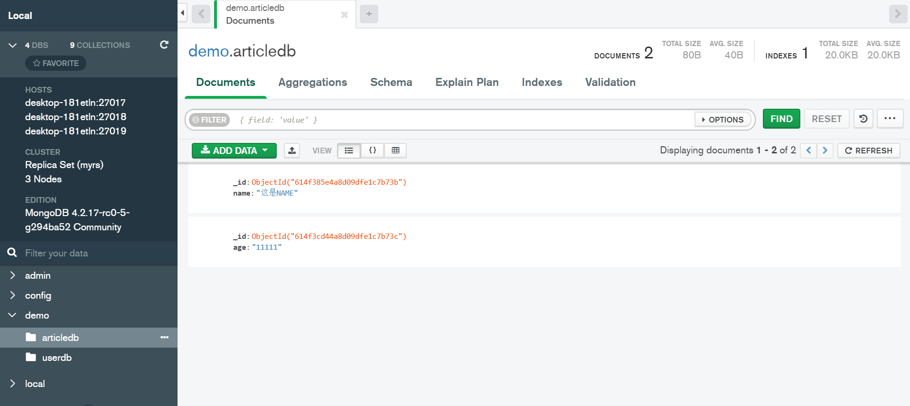

## 副本集

> 副本集集群中有主节点，副本父节点，仲裁节点；副本节点复制主节点的数据，一般提供查询能力，当主节点故障后，通过仲裁节点选择新的主节点
>
> **具备故障迁移及副本集动态扩展**
>
> 适合数据量小且IO高

* 节点角色

  * PRIMARY

    > 主节点

  * SECONDARY

    > 从节点
    >
    > 从节点默认具有读权限，没有写权限
    >
    > * rs.secondaryOk(true/false)
    >
    >   > true:允许从节点进行查询
    >   >
    >   > false:不允许从节点进行查询

  * ARBITER

    > 仲裁节点
    >
    > 默认没有独写权限，不会同步数据，可根据实际情况设置

### 副本节点故障

> 当副本节点故障后，不影响主节点操作
>
> 当副本节点重新启动后，主节点中的数据回自动同步给副本节点

### 主节点选举

* 选集条件

  * 主节点故障
  * 主节点网络不可达(默认心跳为10秒)
  * 人工干预

* 选举规则

  > 当主节点下线后，协调节点通过选择原则来选择主节点

  * 票数最高
  * 获得大多数成员支持
  * 如果前两个条件均相同，则数据新的节点为主节点

  > 可通过设置节点优先级来改变节点的票数

* 当主节点故障，再次启动后，并不会重新升级为主节点

## 搭建步骤

环境：windows10+MongoDB 4.2.17-rc0-5-g294ba52 Community

集群：主节点27017，从节点27018，协调节点27019


> 第一步：依次启动三个节点
>
> 第二步：初始化副本集，当前节点自动为主节点
>
> 第三步：添加从节点
>
> 第四步：添加协调节点


* 初始化副本集

  > rs.initiate()
  >
  > 本节点默认为主节点

* 添加从节点

  > rs.add("DESKTOP-181ETLN:27017")
  >
  > 应使用电脑名
  >
  > 使用localhost或者127.0.0.1均会报错

* 添加仲裁节点

  > rs.addArb("DESKTOP-181ETLN:27019")


* 配置信息：rs.conf()

```shell
{
        "_id" : "myrs",
        "version" : 3,
        "protocolVersion" : NumberLong(1),
        "writeConcernMajorityJournalDefault" : true,
        "members" : [
                {
                        "_id" : 0,
                        "host" : "DESKTOP-181ETLN:27017",
                        "arbiterOnly" : false,
                        "buildIndexes" : true,
                        "hidden" : false,
                        "priority" : 1,
                        "tags" : {

                        },
                        "slaveDelay" : NumberLong(0),
                        "votes" : 1
                },
                {
                        "_id" : 1,
                        "host" : "DESKTOP-181ETLN:27018",
                        "arbiterOnly" : false,
                        "buildIndexes" : true,
                        "hidden" : false,
                        "priority" : 1,
                        "tags" : {

                        },
                        "slaveDelay" : NumberLong(0),
                        "votes" : 1
                },
                {
                        "_id" : 2,
                        "host" : "DESKTOP-181ETLN:27019",
                        "arbiterOnly" : true,
                        "buildIndexes" : true,
                        "hidden" : false,
                        "priority" : 0, # 仲裁节点优先级为0
                        "tags" : {

                        },
                        "slaveDelay" : NumberLong(0),
                        "votes" : 1
                }
        ],
        "settings" : {
                "chainingAllowed" : true,
                "heartbeatIntervalMillis" : 2000,
                "heartbeatTimeoutSecs" : 10,
                "electionTimeoutMillis" : 10000,
                "catchUpTimeoutMillis" : -1,
                "catchUpTakeoverDelayMillis" : 30000,
                "getLastErrorModes" : {

                },
                "getLastErrorDefaults" : {
                        "w" : 1,
                        "wtimeout" : 0
                },
                "replicaSetId" : ObjectId("614f2dcd4798362d59965e61")
        }
}

```


* 副本集状态 rs.status()

```shell
{
        "set" : "myrs",
        "date" : ISODate("2021-09-25T14:52:49.304Z"),
        "myState" : 1,
        "term" : NumberLong(1),
        "syncingTo" : "",
        "syncSourceHost" : "",
        "syncSourceId" : -1,
        "heartbeatIntervalMillis" : NumberLong(2000),
        "majorityVoteCount" : 2,
        "writeMajorityCount" : 2,
        "optimes" : {
                "lastCommittedOpTime" : {
                        "ts" : Timestamp(1632581562, 1),
                        "t" : NumberLong(1)
                },
                "lastCommittedWallTime" : ISODate("2021-09-25T14:52:42.899Z"),
                "readConcernMajorityOpTime" : {
                        "ts" : Timestamp(1632581562, 1),
                        "t" : NumberLong(1)
                },
                "readConcernMajorityWallTime" : ISODate("2021-09-25T14:52:42.899Z"),
                "appliedOpTime" : {
                        "ts" : Timestamp(1632581562, 1),
                        "t" : NumberLong(1)
                },
                "durableOpTime" : {
                        "ts" : Timestamp(1632581562, 1),
                        "t" : NumberLong(1)
                },
                "lastAppliedWallTime" : ISODate("2021-09-25T14:52:42.899Z"),
                "lastDurableWallTime" : ISODate("2021-09-25T14:52:42.899Z")
        },
        "lastStableRecoveryTimestamp" : Timestamp(1632581552, 1),
        "lastStableCheckpointTimestamp" : Timestamp(1632581552, 1),
        "electionCandidateMetrics" : {
                "lastElectionReason" : "electionTimeout",
                "lastElectionDate" : ISODate("2021-09-25T14:10:22.362Z"),
                "electionTerm" : NumberLong(1),
                "lastCommittedOpTimeAtElection" : {
                        "ts" : Timestamp(0, 0),
                        "t" : NumberLong(-1)
                },
                "lastSeenOpTimeAtElection" : {
                        "ts" : Timestamp(1632579022, 1),
                        "t" : NumberLong(-1)
                },
                "numVotesNeeded" : 1,
                "priorityAtElection" : 1,
                "electionTimeoutMillis" : NumberLong(10000),
                "newTermStartDate" : ISODate("2021-09-25T14:10:22.706Z"),
                "wMajorityWriteAvailabilityDate" : ISODate("2021-09-25T14:10:22.859Z")
        },
        "members" : [
                {
                        "_id" : 0,
                        "name" : "DESKTOP-181ETLN:27017",
                        "health" : 1,
                        "state" : 1,
                        "stateStr" : "PRIMARY",
                        "uptime" : 2963,
                        "optime" : {
                                "ts" : Timestamp(1632581562, 1),
                                "t" : NumberLong(1)
                        },
                        "optimeDate" : ISODate("2021-09-25T14:52:42Z"),
                        "syncingTo" : "",
                        "syncSourceHost" : "",
                        "syncSourceId" : -1,
                        "infoMessage" : "",
                        "electionTime" : Timestamp(1632579022, 2),
                        "electionDate" : ISODate("2021-09-25T14:10:22Z"),
                        "configVersion" : 3,
                        "self" : true,
                        "lastHeartbeatMessage" : ""
                },
                {
                        "_id" : 1,
                        "name" : "DESKTOP-181ETLN:27018",
                        "health" : 1,
                        "state" : 2,
                        "stateStr" : "SECONDARY",
                        "uptime" : 290,
                        "optime" : {
                                "ts" : Timestamp(1632581562, 1),
                                "t" : NumberLong(1)
                        },
                        "optimeDurable" : {
                                "ts" : Timestamp(1632581562, 1),
                                "t" : NumberLong(1)
                        },
                        "optimeDate" : ISODate("2021-09-25T14:52:42Z"),
                        "optimeDurableDate" : ISODate("2021-09-25T14:52:42Z"),
                        "lastHeartbeat" : ISODate("2021-09-25T14:52:47.628Z"),
                        "lastHeartbeatRecv" : ISODate("2021-09-25T14:52:47.629Z"),
                        "pingMs" : NumberLong(0),
                        "lastHeartbeatMessage" : "",
                        "syncingTo" : "DESKTOP-181ETLN:27017",
                        "syncSourceHost" : "DESKTOP-181ETLN:27017",
                        "syncSourceId" : 0,
                        "infoMessage" : "",
                        "configVersion" : 3
                },
                {
                        "_id" : 2,
                        "name" : "DESKTOP-181ETLN:27019",
                        "health" : 1,
                        "state" : 7,
                        "stateStr" : "ARBITER",
                        "uptime" : 41,
                        "lastHeartbeat" : ISODate("2021-09-25T14:52:47.626Z"),
                        "lastHeartbeatRecv" : ISODate("2021-09-25T14:52:47.858Z"),
                        "pingMs" : NumberLong(0),
                        "lastHeartbeatMessage" : "",
                        "syncingTo" : "",
                        "syncSourceHost" : "",
                        "syncSourceId" : -1,
                        "infoMessage" : "",
                        "configVersion" : 3
                }
        ],
        "ok" : 1,
        "$clusterTime" : {
                "clusterTime" : Timestamp(1632581562, 1),
                "signature" : {
                        "hash" : BinData(0,"AAAAAAAAAAAAAAAAAAAAAAAAAAA="),
                        "keyId" : NumberLong(0)
                }
        },
        "operationTime" : Timestamp(1632581562, 1)
}
```


## 相关命令

命令行启动服务

> mongod --dbpath=..\data\db 
>
> db文件目录地址

配置文件方式启动服务

> mongod -f D:\application\mongo\mongo\config\config.conf
>
> 配置文件目录地址

windows下服务注册和移除

> * 注册服务:
>
>   > mongod.exe --logpath D:\application\mongo\mongo\log\mongodb.log --logappend --dbpath D:\application\mongo\mongo\data -serviceName MongoDB  --serviceDisplayName MongoDB --install
>
> * 移除服务：
>
>   > mongod.exe --logpath D:\application\mongo\mongo\log\mongodb.log --logappend --dbpath D:\application\mongo\mongo\data --remove --serviceName  MongoDB

* 从节点


* 协调节点



* 主节点

