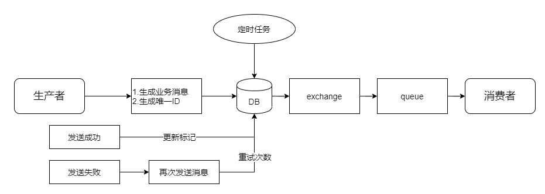
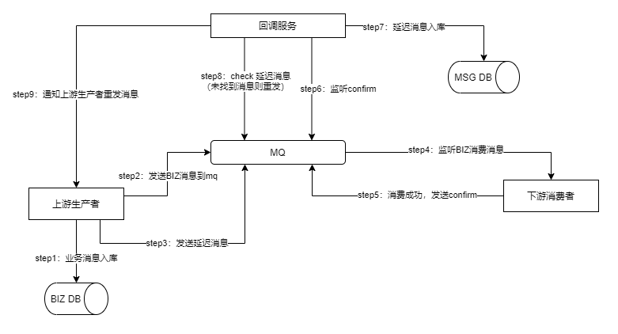

> 前段时间对mq进行改造，进行系统数据流通变更，现结合自己知识体系做一个总结

**业务场景**

> 中心2.0数据变更->canal监听->MQ->中心sync-listener监听->中心3.0&&分省MQ->分省sync-listener监听mq->入库&&数据变更mq
>
> 中心和分省需同步的表相同

* 中心交换机和分省交换机：topic，同一套代码，不同的队列监听
* 数据变更交换机：fanout，数据变更之后通知给其他业务线

## 基础概念

### 数据流通

> 生产者->交换机->队列->消费者

### Exchange

> 交换机，根据规则将消息路由到指定的队列

* fanout

  >广播交换机，忽略rounting key的存在，将消息路由到绑定的所有队列中

* direct 

  >直连交换机，mq默认的交换机，完全根据rounting key路由消息，**精确匹配**
  >
  >mq默认的交换机为一个名称为空的交换机

* topic

  >主题交换机，根据rounting key路由消息，rounting key支持模糊匹配

* headers

  >待实践

### Queue

#### arguments

* x-dead-letter-exchange:配置死信交换机

* x-dead-letter-routing-key:配置死信路由key

* x-expires:配置队列自动删除时间，指定时间段内没有访问则自动删除

* x-message-ttl:配置队列中消息的存活时间

* x-max-length:[配置队列中消息数量的最大值](https://rabbitmq.com/maxlength.html) 

* x-max-length-bytes:[队列中消息的最大容量](https://rabbitmq.com/maxlength.html)

  > 当队列中的消息容量达到最大值时，将从队列头开始删除

* x-single-active-consumer:设置每次只有一个消费者从队列中进行消费

* x-queue-mode:设置队列模式

  > default:队列会存储在内容中，更快的发送给消费者，性能更好
  >
  > lazy:队列中消息尽可能的存储在磁盘中，当消费时加载到内存中

* x-overflow:配置队列溢出行为

  > reject-publish或reject-publish-dlx:最近发布的消息将会丢弃

 ### channel

> 发布消息，接受消息，订阅消息等动作都是在**信道**中完成的
>
> TCP的创建和销毁开销特别大，需要经过3次握手和四次挥手，如果不使用信道，则应用程序会以TCP连接的方式连接RabbitMQ，高峰时刻则会造成资源的浪费，并且会有性能瓶颈

### 虚拟主机

> RabbitMQ可创建多个虚拟主机，每个虚拟主机相当于一个小的RabbitMQ服务器，拥有自己的交换机，队列和绑定关系等，各个虚拟主机之间互不冲突

# 解决方案

## 生产端消息可靠性投递

* 入库打标记

  

* 延迟投递

>如果消费失败，则MSG DB中没有延迟消息，则通知上游重发
>
>可设置重试次数，人工补偿

## 消费者幂等消费

> 当生产者未收到ack确认消息，或者消息发送失败时，可能出现重复发送消息的情况，消费端需要对消息进行幂等处理

* 对消息设置全局唯一ID，对消息进行去重
* 根据具体业务场景，通过主键等唯一值去重

## 可靠性传输

> 消息从生产者传输到消费者过程中可能存在丢失的情况，具体根据丢失的场景做合理处理

* exchange 和 queue 持久化
* rabbitmq事务
* 发送方确认
* 重试机制

## 消费端性能提升

* 单个消费者

  > 单个消费者连接队列，收到消息后将消息放到不同的线程中进行处理(公司业务实际运用)，这样会有多个线程处理消息，增加消费者的吞吐量，提升消费速度

* 增加消费者

## 如何保证消息的顺序性

> 公司业务场景：监听2.0多张表数据的变化，同步到分省
>
> 每张表对应一个队列，每个队列对应一个消费者
>
> 数据变化对应ADD，UPDATE，DELETE三种操作，批量消费数据，先对数据进行操作合并，多线程方式处理

* 每一个队列对应一个消费者，单线程处理，消费者内部采用多线程方式消费

## 消息堵塞处理

> 消息堵塞处理分为前置处理和后置处理，主要记录前置处理

场景分析：半夜消息队列堵塞，消费端来不及处理，生产端还在不断生产消息，此时消息队列可能被撑爆

解决方案：可在生产端添加**限流**，当队列中未消费的消息达到一定数量后，生产者可先将消息入库，当队列中的消息减少到一定数量时，继续将消息发到队列中

# push VS pull

> RabbitMQ消费消息有两种方式：
>
> 一是推送消息，当消息到达队列时，主动推送给消费者
>
> 而是拉取消息，当消息到达队列时，消费者拉取消息，然后消费

参考文章：

https://www.huaweicloud.com/articles/6a2d97cb2cb620b934187ff2670b62f5.html