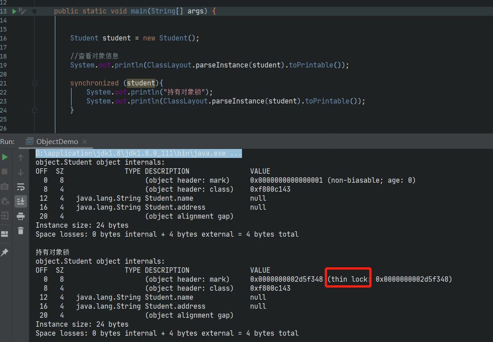
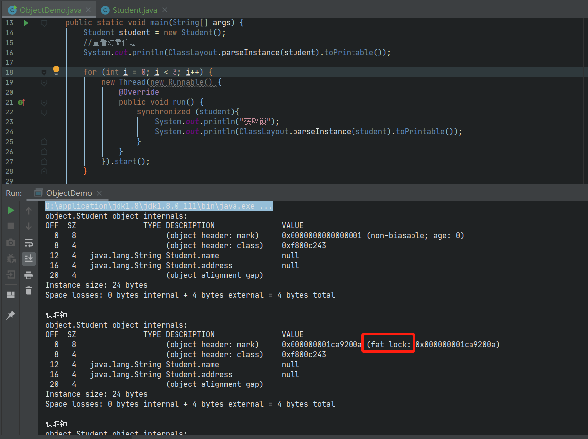

> 强烈推荐JOL工具，根据实践结果验证理论知识
>
> 关于synchronized的用法，对象锁，类锁，轻量级锁，重量级锁，锁膨胀，锁升级，锁优化等技术点，网上的博客很多很多，但自己理解的才真正属于自己的
>
> 借助JOL工具和实践，总结干货

> synchronized加锁过程与对象头有关

## 轻量级锁

> **未获取锁之前的状态值为0000000000000001  表示未锁定状态**
>
> 在无线程竞争的情况下，获取对象锁时使用的轻量级锁  **thin lock**
>
> 轻量级锁的状态应该为01，此处显示的应该是线程ID，跟偏向锁有关

* **关于轻量级锁**

  > 轻量级锁是相对于重量级锁而言的，轻量级比重量级锁具有更小的系统性能开销
  
* **轻量级锁加锁过程**

  > 当代码进入同步块，即线程想要获取对象的锁时
  >
  > 第一步：如果对象没有被锁定，则当前线程创建锁记录空间，用于存储锁对象的Mark Word(拷贝一份)
  >
  > 第二步：JVM通过CAS操作将锁对象的Mark Word指向当前线程的锁记录空间(之前已经复制一份)，如果操作成功则当前线程获取到对象锁

## 重量级锁

> 存在线程竞争时，获取的是重量级锁

* 关于重量级锁

  > 当不存在线程竞争时，获取的是轻量级锁
  >
  > 当存在线程竞争时，获取的时重量级锁

此处涉及Monitor和操作操作系统互斥量等等，比较复杂......

### 锁膨胀

**锁膨胀就是由轻量级锁到重量级锁的过程**

> 当由多个线程竞争锁时，轻量级锁既有CAS操作，还有互斥量的开销，所以直接升级为重量级锁

## 偏向锁

再次理解轻量级锁加锁过程

> 1.当线程线程创建锁记录空间存储对象锁的Mark Word
>
> 2.CAS操作将对象锁的Mark Word指向线程锁记录空间中的Mark Word地址

**偏向锁就是在无竞争的情况下，将CAS操作消除**

JMV约定：

> 在无锁竞争的情况下，当线程第一次获取锁时，JVM会将Mark Word的状态设置为偏向模式，同时使用CAS把获取到这个锁的线程的ID存储在Mark Word中，如果上述操作成功，则当前线程再次获取锁时则不再进行任何操作
>
> 当有其他线程获取这个锁时，撤销偏向锁->未锁定状态->获取轻量级锁->设置偏向锁
>
> 个人理解：
>
> > 每次在获取锁时都要判断是否为偏向锁模式，再判断当前线程是否为偏向线程
> >
> > 如果锁被多个线程访问，则涉及性能开销
> >
> > 可通过JVM参数禁止偏向锁(百度。。。)

## 类锁与对象锁

> synchronized 如果对静态变量加锁、修饰静态代码块或者对类进行加锁时，通常叫做**类锁**
>
> **其本质也是对象锁，因为每个类都有Class 对象**

## 总结

* 轻量级锁为什么比重量级锁重？

  > 轻量级锁是通过CAS操作完成，CAS操作是操作系统提供的一种原子操作，不需要加锁，无额外性能开销
  >
  > 重量级锁是通过操作系统互斥量来实现的，会有加锁和释放锁的性能开销，此处涉及操作系统底层知识(待研究)

* 在项目中需根据业务场景和实际情况合理运用

* 疑问

  > 无法打印出线程id和可重入锁的次数

参考：

《深入理解Java虚拟机》

《Java并发编程实战》