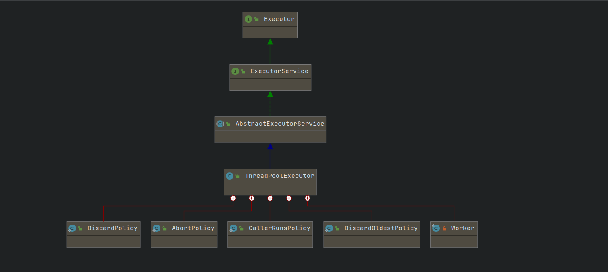

> 在平时工作中经常使用线程池，并且项目中创建线程池的方式也不统一，根据自己的实践并再次阅读源码将自己的理解整理如下

JUC下线程池依赖关系



平时用的最多是ThreadPoolExecutor，也是创建线程池非常推荐的一种方式，可根据业务场景和环境对其参数进行可控配置

下面通过源码对线程池进行分析

## Executor

```java
public interface Executor {
    void execute(Runnable command);
}
```

> Executor是顶级接口，提供提交任务及任务运行的方法

## ExecutorService

```java

public interface ExecutorService extends Executor {
 
    void shutdown();

     
    List<Runnable> shutdownNow();

     
    boolean isShutdown();
 
    boolean isTerminated();
 
    boolean awaitTermination(long timeout, TimeUnit unit)
        throws InterruptedException;

    
    <T> Future<T> submit(Callable<T> task);

    
    <T> Future<T> submit(Runnable task, T result);
 
    Future<?> submit(Runnable task);

    
    <T> List<Future<T>> invokeAll(Collection<? extends Callable<T>> tasks)
        throws InterruptedException;

     
    <T> List<Future<T>> invokeAll(Collection<? extends Callable<T>> tasks,
                                  long timeout, TimeUnit unit)
        throws InterruptedException;

    
    <T> T invokeAny(Collection<? extends Callable<T>> tasks)
        throws InterruptedException, ExecutionException;

         for execution

    <T> T invokeAny(Collection<? extends Callable<T>> tasks,
                    long timeout, TimeUnit unit)
        throws InterruptedException, ExecutionException, TimeoutException;
}

```


## ThreadPoolExecutor

### 核心参数

```java
public ThreadPoolExecutor(int corePoolSize,
                          int maximumPoolSize,
                          long keepAliveTime,
                          TimeUnit unit,
                          BlockingQueue<Runnable> workQueue,
                          ThreadFactory threadFactory,
                          RejectedExecutionHandler handler) {
    if (corePoolSize < 0 ||
        maximumPoolSize <= 0 ||
        maximumPoolSize < corePoolSize ||
        keepAliveTime < 0)
        throw new IllegalArgumentException();
    if (workQueue == null || threadFactory == null || handler == null)
        throw new NullPointerException();
    this.corePoolSize = corePoolSize;
    this.maximumPoolSize = maximumPoolSize;
    this.workQueue = workQueue;
    this.keepAliveTime = unit.toNanos(keepAliveTime);
    this.threadFactory = threadFactory;
    this.handler = handler;
}
```

* corePoolSize:

  > 核心线程数

* maximum:

  > 最大线程数

* keepAliveTime：

  > 线程存活时间，此处的线程指超过核心线程数的线程

* TimeUnit:

  > 线程存活时间单位

* workQueue:

  > 此工作队列是一个阻塞队列，用来存放任务

* ThreadFactory:

  > 线程工厂，此工厂用来创建线程，可进行私有配置

* handler：

  > 拒绝策略
  >
  > 触发条件：队列容量满了


### 线程池的5种状态

> 线程池工作的5种状态

* RUNNING:

  >接受新任务并且执行队列中的任务

* SHUTDOWN:

  > 不接受新的任务，但是执行队列中的任务

* STOP:

  > 不接受新的任务，不执行队列中的任务，**并且中断正在执行的任务**

* TIDYING:

  > 队列中的所有任务都已经执行完毕，调用钩子函数terminated（）

* TERMINATED:

  > 线程池彻底终止工作

## 线程池执行过程分析


```java
public void execute(Runnable command) {
    if (command == null)
        throw new NullPointerException();
    /**
    * 1.如果当前运行的线程数小于核心线程数，则创建线程加入到队列中
    * 如果过程比较复杂，加锁，自旋，cas等操作
    */
    int c = ctl.get();
    if (workerCountOf(c) < corePoolSize) {
        if (addWorker(command, true))
            //2.如果入队成功，退出
            return;
        //3.入队不成功，ctl值表示线程池的当前状态
        c = ctl.get();
    }
    //4.如果是RUNNING状态 并且入队成功
    if (isRunning(c) && workQueue.offer(command)) {
        //获取当前状态
        int recheck = ctl.get();
        //二次校验
        /**
        * 当任务成功入队之后，需要再次检查
        */
        if (! isRunning(recheck) && remove(command))
            reject(command);
        else if (workerCountOf(recheck) == 0)
            addWorker(null, false);
    }
    else if (!addWorker(command, false))
        reject(command);
}
```


> * 此处为什么要做双重校验？
>
>   ctl.get() 获取线程池的当前状态为非原子操作
>
>   此处理解不是很透彻，需要再思考(待研究)


## 触发拒绝策略

> 队列满了则触发拒绝策略，待研究

 

## 对线程池进行管理

> 目前我所在团队的项目中对线程池的应用较多，但是缺乏对线程池的管理，下面结合实践和根据自己的理解进行归纳

首先明确**多线程和异步**的概念，在平时开发过程中不能简单的理解使用了线程池就是使用了多线程，这种方式是错误的

* 多线程

  > 基于一个业务场景：生成excel文件
  >
  > 当数据量特别大或者有大量计算的时候，可开启多个线程处理每一页得数据，最后将多页的数据整合到Excel文件中，输出
  >
  > 个人理解此处就是合理利用了多线程的优势

* 异步

  > 基于一个业务场景：数据同步
  >
  > 当节目集信息变更时，除了更新运营库数据外，还要通知其他外部系统，此时可以单独开启一个线程做信息通知


个人理解线程池的管理应该从以下几个方面进行：

1. 线程池命名

   > 在创建线程池时应该自定义名称，在排查问题时会比较清晰

2. 基于业务模块或者接口划分职责

   > 因为不同接口或者不同业务对线程池的性能，拒绝策略要求不一样，应该单独创建

3. 控制线程池的创建

   > 在项目中要控制线程池创建自由度，当然根据实际情况而定

4. 基于对线程池的运行情况进行分析

   > ExecutorService 具有运行前和运行结束时的钩子函数，可借助来分析线程池的运行情况，最好做持久化可分析，然后进行参数的合理调整，最好参数可动态配置


* RabbitMQ源码中创建线程池的方式

  > CachingConnetionFactory 发送消息时以线程池方式处理
  >
  > 线程池默认使用ThreadPoolExecutor

  ```java
  protected ExecutorService getChannelsExecutor() {
      if (getExecutorService() != null) {
          return getExecutorService(); // NOSONAR never null
      }
      if (this.channelsExecutor == null) {
          synchronized (this.connectionMonitor) {
              if (this.channelsExecutor == null) {
                  final String threadPrefix =
                      getBeanName() == null
                      ? DEFAULT_DEFERRED_POOL_PREFIX + threadPoolId.incrementAndGet()
                      : getBeanName();
                  ThreadFactory threadPoolFactory = new CustomizableThreadFactory(threadPrefix); // NOSONAR never null
                  this.channelsExecutor = Executors.newCachedThreadPool(threadPoolFactory);
              }
          }
      }
      return this.channelsExecutor;
  }
  ```

  