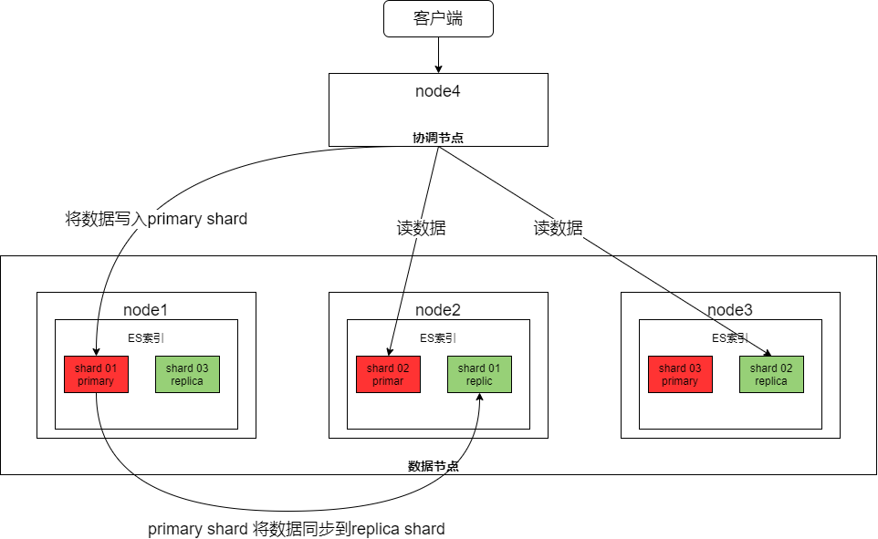
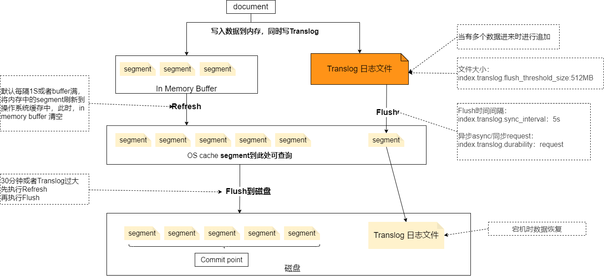

> Elastic Search是目前比较流行的开源的**分布式实时搜索引擎**，底层基于Lucene实现

## 分布式架构原理

> 分布式思想主要体现在shard上以及集群

### 节点角色

* master

  > 负责索引创建，删除等，以及哪些分片分配给哪些节点

* data

  > 数据节点负责存储数据，消耗磁盘和内存

* coordinate

  > 进行客户端请求转发，并负责将查询到的数据进行合并排序等
  >
  > 最好做**读写分离**

* ingest 

  > 数据前置处理转换节点，支持管道操作，结合ELK，具体待研究

  

## 工作原理

> 从写数据和读数据以及分词的角度说明

### 写数据

* 写入过程

  > 1.写请求达到coordinate node，coordinate node 选择 data node
  >
  > 2.data node 写入数据到主分片之上，并同步给replica shard
  >
  > 3.数据写入完成之后，coordinate node 响应给客户端
  >
  > **写数据是一个阻塞过程，可配置**

* 原理

  

