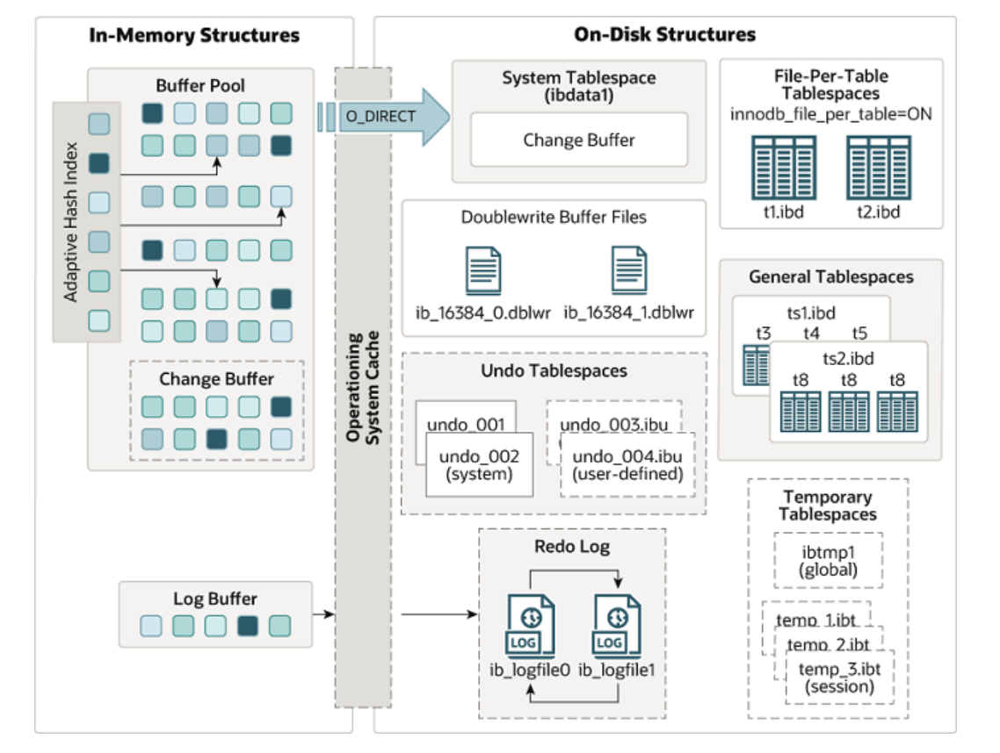
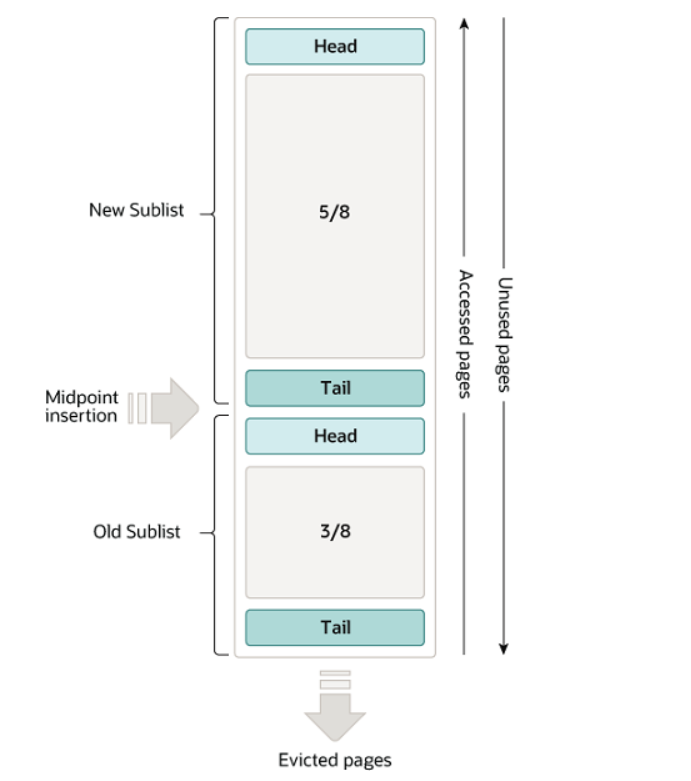

 

> MySQL缓冲池是比较重要的一个模块，必须知道并理解其原理
>
> 以下内容主要通过阅读官方文档，以自己的理解整理如下
>
> [MySQL8.0 document](https://dev.mysql.com/doc/refman/8.0/en/)
>
> 看文档真的不少走很多弯路!

## InnoDB引擎架构图



## 磁盘页和数据页

> 首先达成共识，数据在磁盘中是按页进行存储的《计算机组成原理》，数据的存取也是按页进行的。
>
> 数据页是磁盘与缓冲池之间数据传输的数据量单位
>
> MySQL中数据是按页进行存取的，每页大小默认为16KB（可配置），缓存页的大小也为16KB

## 缓冲池

缓冲池是InnoDB引擎架构中的一个模块，缓冲池存在于内容之中，主要用来对检索频繁的数据做存储，避免直接进行磁盘IO，从而来提高系统性能。

## 缓冲池结构与算法



缓冲池中内存的管理采用LRU算法的变体**中点插入策略**

> 预读或者全表扫描可能会将不会访问的数据存入到缓冲池中，导致热数据从缓冲池中被删除

缓存结构从中间某个点分成两块，一块作为新的链表，另一块作为旧的链表

* 默认新读取的页面插入到旧链表的头部

  > 防止未访问过的页面进入到新链表，加速老化

* 旧链表中的数据需要停留一定时间并被访问时才能进入到新链表的头部

  > 停留时间可配置
  >
  > 防止数据页被连续快速访问几次之后，不再被访问

*  此处设计空闲链表，数据页的Hash，以及描述信息（待研究）

## 预读

> 预读是一个IO行为，将磁盘中页面读取到缓冲池中
>
> 预读分为随机预读和线性预读

## 缓冲池多实例

待研究

## 脏页刷新

> 内存的操作与磁盘的操作速度不是一个数量级，缓冲池中已经被修改但是未刷新到磁盘中的数据称为**脏页**

## 缓冲池优化

> 缓冲池优化从缓冲池实例个数，大小，块大小，新旧链表比例，旧链表停留时间等参数进行优化
>
> 据了解这些参数由DBA执行，但研发需了解(太卷了)

## 缓冲池监控

> 通过命令**SHOW ENGINE INNODB STATUS;**查看缓冲池性能指标
>
> 下面是在本地执行此命令得到的数据，具体分析一下：

```json

InnoDB		
=====================================
2021-11-28 17:46:18 0x3308 INNODB MONITOR OUTPUT
=====================================
Per second averages calculated from the last 1 seconds
-----------------
BACKGROUND THREAD
-----------------
srv_master_thread loops: 3 srv_active, 0 srv_shutdown, 167777 srv_idle
srv_master_thread log flush and writes: 167780
----------
SEMAPHORES
----------
OS WAIT ARRAY INFO: reservation count 4
OS WAIT ARRAY INFO: signal count 4
RW-shared spins 0, rounds 4, OS waits 2
RW-excl spins 0, rounds 0, OS waits 0
RW-sx spins 0, rounds 0, OS waits 0
Spin rounds per wait: 4.00 RW-shared, 0.00 RW-excl, 0.00 RW-sx
------------
TRANSACTIONS
------------
Trx id counter 299779
Purge done for trx's n:o < 0 undo n:o < 0 state: running but idle
History list length 0
LIST OF TRANSACTIONS FOR EACH SESSION:
---TRANSACTION 283635377744536, not started
0 lock struct(s), heap size 1136, 0 row lock(s)
---TRANSACTION 283635377743664, not started
0 lock struct(s), heap size 1136, 0 row lock(s)
--------
FILE I/O
--------
I/O thread 0 state: wait Windows aio (insert buffer thread)
I/O thread 1 state: wait Windows aio (log thread)
I/O thread 2 state: wait Windows aio (read thread)
I/O thread 3 state: wait Windows aio (read thread)
I/O thread 4 state: wait Windows aio (read thread)
I/O thread 5 state: wait Windows aio (read thread)
I/O thread 6 state: wait Windows aio (write thread)
I/O thread 7 state: wait Windows aio (write thread)
I/O thread 8 state: wait Windows aio (write thread)
I/O thread 9 state: wait Windows aio (write thread)
Pending normal aio reads: [0, 0, 0, 0] , aio writes: [0, 0, 0, 0] ,
 ibuf aio reads:, log i/o's:, sync i/o's:
Pending flushes (fsync) log: 0; buffer pool: 0
551 OS file reads, 70 OS file writes, 7 OS fsyncs
0.00 reads/s, 0 avg bytes/read, 0.00 writes/s, 0.00 fsyncs/s
-------------------------------------
INSERT BUFFER AND ADAPTIVE HASH INDEX
-------------------------------------
Ibuf: size 1, free list len 1598, seg size 1600, 0 merges
merged operations:
 insert 0, delete mark 0, delete 0
discarded operations:
 insert 0, delete mark 0, delete 0
Hash table size 34679, node heap has 3 buffer(s)
Hash table size 34679, node heap has 0 buffer(s)
Hash table size 34679, node heap has 0 buffer(s)
Hash table size 34679, node heap has 0 buffer(s)
Hash table size 34679, node heap has 0 buffer(s)
Hash table size 34679, node heap has 0 buffer(s)
Hash table size 34679, node heap has 0 buffer(s)
Hash table size 34679, node heap has 2 buffer(s)
0.00 hash searches/s, 0.00 non-hash searches/s
---
LOG
---
Log sequence number 7091687636
Log flushed up to   7091687636
Pages flushed up to 7091687636
Last checkpoint at  7091687627
0 pending log flushes, 0 pending chkp writes
10 log i/o's done, 0.00 log i/o's/second
----------------------
BUFFER POOL AND MEMORY
----------------------
Total large memory allocated 137297920
Dictionary memory allocated 111425
Buffer pool size   8191		#分配给缓冲池的总页面大小
Free buffers       1024		#空闲列表大小(页为单位)
Database pages     7156		#缓冲池LRU列表总大小(页为单位)
Old database pages 2621		#缓冲池LRU旧列表大小
Modified db pages  0		#当前在缓冲池中修改的页数
Pending reads      0
Pending writes: LRU 0, flush list 0, single page 0
Pages made young 0, not young 0
0.00 youngs/s, 0.00 non-youngs/s
Pages read 523, created 49, written 53
0.00 reads/s, 0.00 creates/s, 0.00 writes/s
No buffer pool page gets since the last printout
Pages read ahead 0.00/s, evicted without access 0.00/s, Random read ahead 0.00/s
LRU len: 572, unzip_LRU len: 0
I/O sum[0]:cur[0], unzip sum[0]:cur[0]
--------------
ROW OPERATIONS
--------------
0 queries inside InnoDB, 0 queries in queue
0 read views open inside InnoDB
Process ID=5944, Main thread ID=11188, state: sleeping
Number of rows inserted 48, updated 0, deleted 0, read 56
0.00 inserts/s, 0.00 updates/s, 0.00 deletes/s, 0.00 reads/s
----------------------------
END OF INNODB MONITOR OUTPUT
============================
```

## change buffer

跟二级索引有关系，个人理解二级索引页也会加载到缓冲池中，涉及二级索引页的维护及刷新

