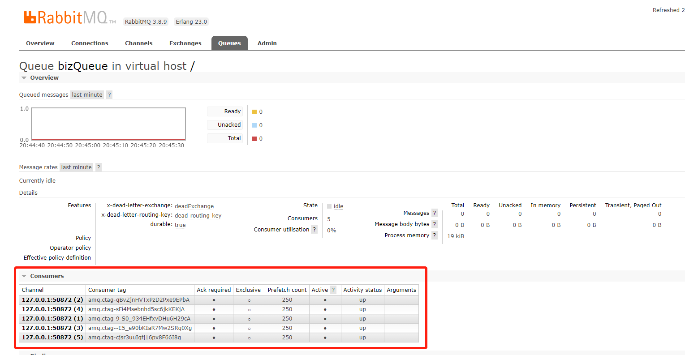

> SimpleMessageListenerContainer是Spring在RabbotMQ原生API基础上封装的一个消费工具类。
>
> 在项目中经常碰到，通过阅读官方文档和源码，将自己的理解整理如下：

SimpleMessageListenerContainer功能强大，具备队列之间的**隔离性**，及消费者属性配置

## 属性

### AcknowledgeMode

> 设置消息确认模式 
>
> ```：
> AUTO：自动确认
> MANUAL：手动确认
> NONE：不确认
> ```

### MessageListener

> 设置监听者

### Queues

> 设置监听的队列，体现出隔离性
>
> ```java
> //设置监听的队列
> simpleMessageListenerContainer.setQueueNames("bizQueue");
> simpleMessageListenerContainer.setQueues(new Queue("bizQueue"));
> ```
>
> 

### PrefetchCount && batchSize

> 在实际应用场景中，开启ack确认模式，当消费者从队列中获取到一定的消息之后，在消息未确认之前，希望队列不再推送消息到消费者，此时可通过prefetchCount设置未ack状态消息的最大数量
>
> PrefetchCount ：设置预取数量，默认为250
>
> batchSize：每个消费者消费一批消息的数量，默认为1
>
> 实际预取数量为：getPrefetchCount() > this.batchSize ? getPrefetchCount() : this.batchSize;

```java
protected BlockingQueueConsumer createBlockingQueueConsumer() {
    BlockingQueueConsumer consumer;
    String[] queues = getQueueNames();
    // There's no point prefetching less than the tx size, otherwise the consumer will stall because the broker
    // didn't get an ack for delivered messages
    // 实际预取数量
    int actualPrefetchCount = getPrefetchCount() > this.batchSize ? getPrefetchCount() : this.batchSize;
    consumer = new BlockingQueueConsumer(getConnectionFactory(), getMessagePropertiesConverter(),
                                         this.cancellationLock, getAcknowledgeMode(), isChannelTransacted(), actualPrefetchCount,
                                         isDefaultRequeueRejected(), getConsumerArguments(), isNoLocal(), isExclusive(), queues);
    if (this.declarationRetries != null) {
        consumer.setDeclarationRetries(this.declarationRetries);
    }
    if (getFailedDeclarationRetryInterval() > 0) {
        consumer.setFailedDeclarationRetryInterval(getFailedDeclarationRetryInterval());
    }
    if (this.retryDeclarationInterval != null) {
        consumer.setRetryDeclarationInterval(this.retryDeclarationInterval);
    }
    ConsumerTagStrategy consumerTagStrategy = getConsumerTagStrategy();
    if (consumerTagStrategy != null) {
        consumer.setTagStrategy(consumerTagStrategy);
    }
    consumer.setBackOffExecution(getRecoveryBackOff().start());
    consumer.setShutdownTimeout(getShutdownTimeout());
    consumer.setApplicationEventPublisher(getApplicationEventPublisher());
    return consumer;
}

```

### ConcurrentConsumers

> 设置多个消费者并发一起消费，默认为 1，
>
> ```
> private volatile int concurrentConsumers = 1;
> ```



### MaxConcurrentConsumers

> 设置最多的并发消费者数量
>
> 此值必须大于ConcurrentConsumers，否则启动报异常

```java
public void setMaxConcurrentConsumers(int maxConcurrentConsumers) {
    Assert.isTrue(maxConcurrentConsumers >= this.concurrentConsumers,
                  "'maxConcurrentConsumers' value must be at least 'concurrentConsumers'");
    Assert.isTrue(!isExclusive() || maxConcurrentConsumers == 1,
                  "When the consumer is exclusive, the concurrency must be 1");
    Integer oldMax = this.maxConcurrentConsumers;
    this.maxConcurrentConsumers = maxConcurrentConsumers;
    if (oldMax != null && isActive()) {
        int delta = oldMax - maxConcurrentConsumers;
        if (delta > 0) { // only decrease, not increase
            adjustConsumers(delta);
        }
    }

}
```

### MessageListener

> 设置消息监听类

### AfterReceivePostProcessors

> 设置消息后置处理器

```java
//设置消息后置处理器
simpleMessageListenerContainer.setAfterReceivePostProcessors(new MessagePostProcessor() {
    @Override
    public Message postProcessMessage(Message message) throws AmqpException {
        message.getMessageProperties().getHeaders().put("queue","biz");
        return message;
    }
});
```

## 实例

```java 
@Bean("bizContainer")
public SimpleMessageListenerContainer simpleMessageListenerContainer(@Qualifier("bizConnectionFactory") ConnectionFactory connectionFactory,
                                                                     @Qualifier("bizMessageListener") BizMessageListener messageListener) {
    SimpleMessageListenerContainer simpleMessageListenerContainer = new SimpleMessageListenerContainer(connectionFactory);
    //设置监听的队列
    simpleMessageListenerContainer.setQueueNames("bizQueue");
    simpleMessageListenerContainer.setQueues(new Queue("bizQueue"));
    //待研究
    simpleMessageListenerContainer.setReceiveTimeout(1000);
    //设置消息后置处理器
    simpleMessageListenerContainer.setAfterReceivePostProcessors(new MessagePostProcessor() {
        @Override
        public Message postProcessMessage(Message message) throws AmqpException {
            message.getMessageProperties().getHeaders().put("queue","biz");
            return message;
        }
    });
    //设置监听者
    simpleMessageListenerContainer.setMessageListener(messageListener);
    //设置消息确认模式
    simpleMessageListenerContainer.setAcknowledgeMode(AcknowledgeMode.MANUAL);
    //设置自动创建
    simpleMessageListenerContainer.setAutoDeclare(true);
    //设置当前消费者的数量
    simpleMessageListenerContainer.setConcurrentConsumers(5);
    //设置最大消费者的数量
    simpleMessageListenerContainer.setMaxConcurrentConsumers(10);
    //设置批量处理消息数量
    simpleMessageListenerContainer.setBatchSize(3);
    //设置已消费但未ack的消息的数量，即Unacked
    simpleMessageListenerContainer.setPrefetchCount(1);

    return simpleMessageListenerContainer;
}
```


## 获取消息源码

> 为每个消费者开启一个线程，轮询获取消息


* 为消费者创建Processor

  ```java
  protected void addAndStartConsumers(int delta) {
      synchronized (this.consumersMonitor) {
          if (this.consumers != null) {
              for (int i = 0; i < delta; i++) {
                  if (this.maxConcurrentConsumers != null
                      && this.consumers.size() >= this.maxConcurrentConsumers) {
                      break;
                  }
                  BlockingQueueConsumer consumer = createBlockingQueueConsumer();
                  this.consumers.add(consumer);
                  //生成processor
                  AsyncMessageProcessingConsumer processor = new AsyncMessageProcessingConsumer(consumer);
                  if (logger.isDebugEnabled()) {
                      logger.debug("Starting a new consumer: " + consumer);
                  }
                  //开启线程
                  getTaskExecutor().execute(processor);
                  if (this.getApplicationEventPublisher() != null) {
                      this.getApplicationEventPublisher().publishEvent(new AsyncConsumerStartedEvent(this, consumer));
                  }
                  try {
                      FatalListenerStartupException startupException = processor.getStartupException();
                      if (startupException != null) {
                          this.consumers.remove(consumer);
                          throw new AmqpIllegalStateException("Fatal exception on listener startup", startupException);
                      }
                  }
                  catch (InterruptedException ie) {
                      Thread.currentThread().interrupt();
                  }
                  catch (Exception e) {
                      consumer.stop();
                      logger.error("Error starting new consumer", e);
                      this.cancellationLock.release(consumer);
                      this.consumers.remove(consumer);
                  }
              }
          }
      }
  }
  ```

* 轮询获取消息

  ```java
  private final class AsyncMessageProcessingConsumer implements Runnable {
  
      private static final int ABORT_EVENT_WAIT_SECONDS = 5;
  
      private final BlockingQueueConsumer consumer;
  
      private final CountDownLatch start;
  
      private volatile FatalListenerStartupException startupException;
  
      private int consecutiveIdles;
  
      private int consecutiveMessages;
  
  
      AsyncMessageProcessingConsumer(BlockingQueueConsumer consumer) {
          this.consumer = consumer;
          this.start = new CountDownLatch(1);
      }
  
      /**
  		 * Retrieve the fatal startup exception if this processor completely failed to locate the broker resources it
  		 * needed. Blocks up to 60 seconds waiting for an exception to occur
  		 * (but should always return promptly in normal circumstances).
  		 * No longer fatal if the processor does not start up in 60 seconds.
  		 * @return a startup exception if there was one
  		 * @throws InterruptedException if the consumer startup is interrupted
  		 */
      private FatalListenerStartupException getStartupException() throws InterruptedException {
          if (!this.start.await(
              SimpleMessageListenerContainer.this.consumerStartTimeout, TimeUnit.MILLISECONDS)) {
              logger.error("Consumer failed to start in "
                           + SimpleMessageListenerContainer.this.consumerStartTimeout
                           + " milliseconds; does the task executor have enough threads to support the container "
                           + "concurrency?");
          }
          return this.startupException;
      }
  
      @Override // NOSONAR - complexity - many catch blocks
      public void run() { // NOSONAR - line count
          if (!isActive()) {
              return;
          }
  
          boolean aborted = false;
  
          this.consumer.setLocallyTransacted(isChannelLocallyTransacted());
  
          String routingLookupKey = getRoutingLookupKey();
          if (routingLookupKey != null) {
              SimpleResourceHolder.bind(getRoutingConnectionFactory(), routingLookupKey); // NOSONAR both never null
          }
  
          if (this.consumer.getQueueCount() < 1) {
              if (logger.isDebugEnabled()) {
                  logger.debug("Consumer stopping; no queues for " + this.consumer);
              }
              SimpleMessageListenerContainer.this.cancellationLock.release(this.consumer);
              if (getApplicationEventPublisher() != null) {
                  getApplicationEventPublisher().publishEvent(
                      new AsyncConsumerStoppedEvent(SimpleMessageListenerContainer.this, this.consumer));
              }
              this.start.countDown();
              return;
          }
  
          try {
              initialize();
              while (isActive(this.consumer) || this.consumer.hasDelivery() || !this.consumer.cancelled()) {
                  mainLoop();
              }
          }
          catch (InterruptedException e) {
              logger.debug("Consumer thread interrupted, processing stopped.");
              Thread.currentThread().interrupt();
              aborted = true;
              publishConsumerFailedEvent("Consumer thread interrupted, processing stopped", true, e);
          }
          catch (QueuesNotAvailableException ex) {
              logger.error("Consumer threw missing queues exception, fatal=" + isMissingQueuesFatal(), ex);
              if (isMissingQueuesFatal()) {
                  this.startupException = ex;
                  // Fatal, but no point re-throwing, so just abort.
                  aborted = true;
              }
              publishConsumerFailedEvent("Consumer queue(s) not available", aborted, ex);
          }
          catch (FatalListenerStartupException ex) {
              logger.error("Consumer received fatal exception on startup", ex);
              this.startupException = ex;
              // Fatal, but no point re-throwing, so just abort.
              aborted = true;
              publishConsumerFailedEvent("Consumer received fatal exception on startup", true, ex);
          }
          catch (FatalListenerExecutionException ex) { // NOSONAR exception as flow control
              logger.error("Consumer received fatal exception during processing", ex);
              // Fatal, but no point re-throwing, so just abort.
              aborted = true;
              publishConsumerFailedEvent("Consumer received fatal exception during processing", true, ex);
          }
          catch (PossibleAuthenticationFailureException ex) {
              logger.error("Consumer received fatal=" + isPossibleAuthenticationFailureFatal() +
                           " exception during processing", ex);
              if (isPossibleAuthenticationFailureFatal()) {
                  this.startupException =
                      new FatalListenerStartupException("Authentication failure",
                                                        new AmqpAuthenticationException(ex));
                  // Fatal, but no point re-throwing, so just abort.
                  aborted = true;
              }
              publishConsumerFailedEvent("Consumer received PossibleAuthenticationFailure during startup", aborted, ex);
          }
          catch (ShutdownSignalException e) {
              if (RabbitUtils.isNormalShutdown(e)) {
                  if (logger.isDebugEnabled()) {
                      logger.debug("Consumer received Shutdown Signal, processing stopped: " + e.getMessage());
                  }
              }
              else {
                  logConsumerException(e);
              }
          }
          catch (AmqpIOException e) {
              if (e.getCause() instanceof IOException && e.getCause().getCause() instanceof ShutdownSignalException
                  && e.getCause().getCause().getMessage().contains("in exclusive use")) {
                  getExclusiveConsumerExceptionLogger().log(logger,
                                                            "Exclusive consumer failure", e.getCause().getCause());
                  publishConsumerFailedEvent("Consumer raised exception, attempting restart", false, e);
              }
              else {
                  logConsumerException(e);
              }
          }
          catch (Error e) { //NOSONAR
              // ok to catch Error - we're aborting so will stop
              logger.error("Consumer thread error, thread abort.", e);
              publishConsumerFailedEvent("Consumer threw an Error", true, e);
              aborted = true;
          }
          catch (Throwable t) { //NOSONAR
              // by now, it must be an exception
              if (isActive()) {
                  logConsumerException(t);
              }
          }
          finally {
              if (getTransactionManager() != null) {
                  ConsumerChannelRegistry.unRegisterConsumerChannel();
              }
          }
  
          // In all cases count down to allow container to progress beyond startup
          this.start.countDown();
  
          killOrRestart(aborted);
  
          if (routingLookupKey != null) {
              SimpleResourceHolder.unbind(getRoutingConnectionFactory()); // NOSONAR never null here
          }
      }
  
      private void mainLoop() throws Exception { // NOSONAR Exception
          try {
              boolean receivedOk = receiveAndExecute(this.consumer); // At least one message received
              if (SimpleMessageListenerContainer.this.maxConcurrentConsumers != null) {
                  checkAdjust(receivedOk);
              }
              long idleEventInterval = getIdleEventInterval();
              if (idleEventInterval > 0) {
                  if (receivedOk) {
                      updateLastReceive();
                  }
                  else {
                      long now = System.currentTimeMillis();
                      long lastAlertAt = SimpleMessageListenerContainer.this.lastNoMessageAlert.get();
                      long lastReceive = getLastReceive();
                      if (now > lastReceive + idleEventInterval
                          && now > lastAlertAt + idleEventInterval
                          && SimpleMessageListenerContainer.this.lastNoMessageAlert
                          .compareAndSet(lastAlertAt, now)) {
                          publishIdleContainerEvent(now - lastReceive);
                      }
                  }
              }
          }
          catch (ListenerExecutionFailedException ex) {
              // Continue to process, otherwise re-throw
              if (ex.getCause() instanceof NoSuchMethodException) {
                  throw new FatalListenerExecutionException("Invalid listener", ex);
              }
          }
          catch (AmqpRejectAndDontRequeueException rejectEx) {
              /*
  				 *  These will normally be wrapped by an LEFE if thrown by the
  				 *  listener, but we will also honor it if thrown by an
  				 *  error handler.
  				 */
          }
      }
  
      private void checkAdjust(boolean receivedOk) {
          if (receivedOk) {
              if (isActive(this.consumer)) {
                  this.consecutiveIdles = 0;
                  if (this.consecutiveMessages++ > SimpleMessageListenerContainer.this.consecutiveActiveTrigger) {
                      considerAddingAConsumer();
                      this.consecutiveMessages = 0;
                  }
              }
          }
          else {
              this.consecutiveMessages = 0;
              if (this.consecutiveIdles++ > SimpleMessageListenerContainer.this.consecutiveIdleTrigger) {
                  considerStoppingAConsumer(this.consumer);
                  this.consecutiveIdles = 0;
              }
          }
      }
  
      private void initialize() throws Throwable { // NOSONAR
          try {
              redeclareElementsIfNecessary();
              this.consumer.start();
              this.start.countDown();
          }
          catch (QueuesNotAvailableException e) {
              if (isMissingQueuesFatal()) {
                  throw e;
              }
              else {
                  this.start.countDown();
                  handleStartupFailure(this.consumer.getBackOffExecution());
                  throw e;
              }
          }
          catch (FatalListenerStartupException ex) {
              if (isPossibleAuthenticationFailureFatal()) {
                  throw ex;
              }
              else {
                  Throwable possibleAuthException = ex.getCause().getCause();
                  if (!(possibleAuthException instanceof PossibleAuthenticationFailureException)) {
                      throw ex;
                  }
                  else {
                      this.start.countDown();
                      handleStartupFailure(this.consumer.getBackOffExecution());
                      throw possibleAuthException;
                  }
              }
          }
          catch (Throwable t) { //NOSONAR
              this.start.countDown();
              handleStartupFailure(this.consumer.getBackOffExecution());
              throw t;
          }
  
          if (getTransactionManager() != null) {
              /*
  				 * Register the consumer's channel so it will be used by the transaction manager
  				 * if it's an instance of RabbitTransactionManager.
  				 */
              ConsumerChannelRegistry.registerConsumerChannel(this.consumer.getChannel(), getConnectionFactory());
          }
      }
  
      private void killOrRestart(boolean aborted) {
          if (!isActive(this.consumer) || aborted) {
              logger.debug("Cancelling " + this.consumer);
              try {
                  this.consumer.stop();
                  SimpleMessageListenerContainer.this.cancellationLock.release(this.consumer);
                  if (getApplicationEventPublisher() != null) {
                      getApplicationEventPublisher().publishEvent(
                          new AsyncConsumerStoppedEvent(SimpleMessageListenerContainer.this, this.consumer));
                  }
              }
              catch (AmqpException e) {
                  logger.info("Could not cancel message consumer", e);
              }
              if (aborted && SimpleMessageListenerContainer.this.containerStoppingForAbort
                  .compareAndSet(null, Thread.currentThread())) {
                  logger.error("Stopping container from aborted consumer");
                  stop();
                  SimpleMessageListenerContainer.this.containerStoppingForAbort.set(null);
                  ListenerContainerConsumerFailedEvent event = null;
                  do {
                      try {
                          event = SimpleMessageListenerContainer.this.abortEvents.poll(ABORT_EVENT_WAIT_SECONDS,
                                                                                       TimeUnit.SECONDS);
                          if (event != null) {
                              SimpleMessageListenerContainer.this.publishConsumerFailedEvent(
                                  event.getReason(), event.isFatal(), event.getThrowable());
                          }
                      }
                      catch (InterruptedException e) {
                          Thread.currentThread().interrupt();
                      }
                  }
                  while (event != null);
              }
          }
          else {
              logger.info("Restarting " + this.consumer);
              restart(this.consumer);
          }
      }
  
      private void logConsumerException(Throwable t) {
          if (logger.isDebugEnabled()
              || !(t instanceof AmqpConnectException || t instanceof ConsumerCancelledException)) {
              logger.debug(
                  "Consumer raised exception, processing can restart if the connection factory supports it",
                  t);
          }
          else {
              if (t instanceof ConsumerCancelledException && this.consumer.isNormalCancel()) {
                  if (logger.isDebugEnabled()) {
                      logger.debug(
                          "Consumer raised exception, processing can restart if the connection factory supports it. "
                          + "Exception summary: " + t);
                  }
              }
              else if (logger.isWarnEnabled()) {
                  logger.warn(
                      "Consumer raised exception, processing can restart if the connection factory supports it. "
                      + "Exception summary: " + t);
              }
          }
          publishConsumerFailedEvent("Consumer raised exception, attempting restart", false, t);
      }
  
  }
  ```

  

